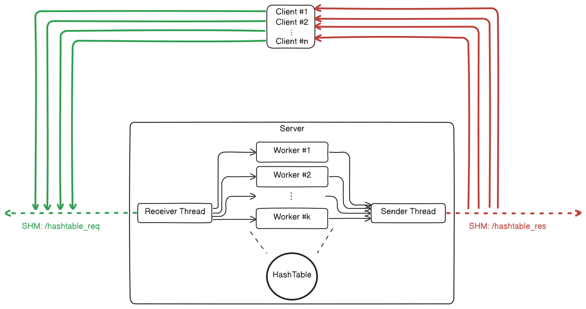

# Hashtable, a hashmap server / client implemented with POSIX shm
## How to run
### Prerequisites:
- A working [Rust](https://www.rust-lang.org/tools/install) toolchain (stable channel)
- Linux kernel with `tmpfs` support for POSIX shared memory (enabled by default)
- For the benchmarks: [Hyperfine](https://github.com/sharkdp/hyperfine)
- For the perf analysis:
  - [Perf](https://perfwiki.github.io/main/) with the necessary kernel parameters set
  - [Hotspot](https://github.com/KDAB/hotspot) for inspecting the perf data

### Building and Running
- Binaries:
  - To build the binaries: Run `make build`
  - This will generate the respective binary under `target/release/[server/client]`

- Benchmarks:
  - To start the benchmarks: Run `make bench`

- Perf:
  - To collect `perf` data from a load test: Run `make perf`
  - The resulting data will be saved to `analysis/perf_*`, and can be inspected with Hotspot

## Components
### HashTable
The HashTable is implemented in `server/src/hash_table.rs` with an array of Linked Lists,
locked individually by Reader-Writer locks.

It can be used with any Keys that are Hashable, in the current server it is used with:
- Key: `ArrayString<64>`, a heapless string which can store 64 bytes
- Value: `u32`

### Server
The server accepts the following arguments:
- `-s <usize>`: Number of Buckets in the HashTable
- `-n <usize>`: Number of worker threads to spawn

On startup, it creates two shared memory regions, initializes all semaphores and values,
and then writes the value `MAGIC = 0x77256810` to the first field in each memory region to signal readyness.

It then listens on the `/hashtable_req` by blocking on a semaphore until a client sends a message.

Incoming messages are forwarded to the workers internally via a mpmc channel (`crossbeam_channel`)

The messages are claimed by worker threads, which execute the contained operation on the HashTable.
Afterwards, the result of the operation is forwarded via a second mpmc channel to the sender thread.

The sender thread then sends the responses back to **all** clients over `/hashtable_res`

### Client
The client accepts the following arguments:
- `ol: usize (positional)`: Number of outer loop iterations (runs), provide 0 for infinite
- `il: usize (positional)`: Number of values to be processed each run

It then maps the respective shared memory regions, checks for the `MAGIC` value and then executes:
- Generate `client_id` (random `u32`)
- Generate `seed` (random `u32`)
- For `j in 0..ol`
  - Generate `il` random string keys = `"ht{$seed}{$rand_u32()}"`
  - Insert:
    - For `i in 0..il`: Send request to insert (`key[i]`, `i`)
    - Collect and verify responses
  - Read:
    - For `i in 0..il`: Send request to read bucket of `key[i]`
    - Collect responses and verify that bucket `key[i]` contains `i`
  - Delete
    - For `i in 0..il`: Send request to delete key `key[i]`
    - Collect and verify responses

To associate the requests with the responses, each request carries a `request_id: u32`,
which is included with the response again.

Since every client gets every message, clients discard messages that are not containing their `client_id`

## Architecture
`1` server and `n` clients communicate over two shared memory buffers, requests from client to server via `/hashtable_req`, responses via `/hashtable_res`.

Each client can request the server to execute the following commands:
- Insert an item (Key: Stack-Only String (size max 64 bytes), Value: u32)
- Delete an item
- Dump the contents of a bucket (by specifying the bucket number or an item which is contained in it)
  - Currently only works up to 32 elements per bucket, due to fixed sizing of `ftruncate`

The accesses are synchronized via POSIX semaphores, with different mechanisms:
- The requests on `/hashtable_req` are implemented via two mutexes `busy` and `waker`
  - One client (writer) at a time can lock `busy`, write a request into the buffer and notify the server via `waker`
  - The server reads only after locking `waker`, and wakes up the next client with `busy` when it has finished reading
- The responses on `hashtable_res` are synchronized via a reusable *two-phase barrier* with wakers, achieving lockstep synchronization similar to a SPMC channel with a capacity of 1

## Performance Evaluation
Please refer to the [Analysis](analysis/ANALYSIS.md)
