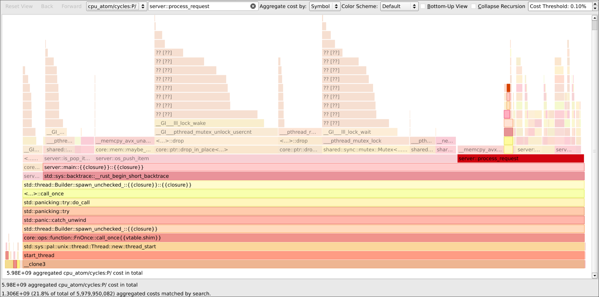

# Analysis of performance - Version with Ring Buffer Optimizations

After identification of performance bottlenecks in the internal dispatching and communication between the server and the clients,
the architecture was reworked:

- Requests are submitted to a ring buffer in a MPMC fashion, each worker thread can independently consume from the queue
- Responses are submitted to a MPMC broadcast queue implemented over a second ring buffer,
items get deleted from the queue once all clients have seen them, all worker threads can place items on the queue
- The internal dispatching queue (crossbeam) was removed

This improved performance significantly across the board, most notably for scenarios with multiple clients:

```
[before]
-- Benchmark ManyClientsMT (server -s 10000 -n 16) (16 bg clients, iLoop iterations 10) --
Benchmark 1: target/benchmark/client 100 10
  Time (mean ± σ):      2.638 s ±  0.056 s    [User: 0.095 s, System: 0.246 s]
  Range (min … max):    2.589 s …  2.776 s    10 runs

[after]
-- Benchmark ManyClientsMT (server -s 10000 -n 16) (16 bg clients, iLoop iterations 10) --
Benchmark 1: target/benchmark/client 100 10
  Time (mean ± σ):     160.6 ms ±  23.2 ms    [User: 135.7 ms, System: 10.5 ms]
  Range (min … max):   123.6 ms … 197.4 ms    19 runs
```

Suprisingly, multithreaded executions of the server still seem to have relatively little gain over singlethreaded runs:
```
-- Benchmark ManyClientsST (server -s 10000 -n 1) (16 bg clients, iLoop iterations 10) --
Benchmark 1: target/benchmark/client 100 10
  Time (mean ± σ):     183.7 ms ±  40.8 ms    [User: 172.6 ms, System: 4.1 ms]
  Range (min … max):   115.4 ms … 253.4 ms    14 runs

-- Benchmark ManyClientsMT (server -s 10000 -n 16) (16 bg clients, iLoop iterations 10) --
Benchmark 1: target/benchmark/client 100 10
  Time (mean ± σ):     160.6 ms ±  23.2 ms    [User: 135.7 ms, System: 10.5 ms]
  Range (min … max):   123.6 ms … 197.4 ms    19 runs


16 visitors at 16 threads is faster than 16 visitors at 1 thread: 1.14x
```

To evaluate this further, more perf data was collected from after the optimization:


It can be seen that the communication efforts to and from the clients still consume the majority of cycles (~65% combined for `is_pop_item` + `os_push_item`)
, but the share consumed by HashTable operations has risen to over 20% (from ~0.7% before):



There is also a disparity between the receive queue and the send queue, sending responses consumes much more cycles than receiving requests at higher client counts.

Looking at the procedure for writing and reading from the response queue, the reasons for this become evident:
- As all consumers have to read a value before it can be freed
(and consumers block each other at least partly when acquiring the slot rwlock),
producers have to wait longer and longer for the slot to become unused again with more and more clients
- Response Data Payloads (especially read bucket responses) contain much more data than the requests.
This increases the time it takes to copy a response into the shared memory region,
blocking other server threads in the meantime due to the tail lock

The performance in this area could further be improved by introducing sharding
(each server thread gets their own request and response queue, clients always join the least contended shard)

Other approaches, like an unbounded queue with linked lists, or creating dynamic queues per-client
are infeasible to realize in POSIX shared memory regions, as they are fixed-size memory blocks.

To achieve near 1:1 scaling (16x clients ≈ 16x throughput),
a solution built on top of network protocols (udp, tcp) or unix domain sockets could be used instead of shared memory,
since the transmitted data size is relatively small and the operation frequency is high.

Generally it seems that operating on top of a shared memory region, with the necessary synchronization in place,
profits from a fixed, smaller number of communicating peers, which send large amounts of data at moderate operation frequency.
