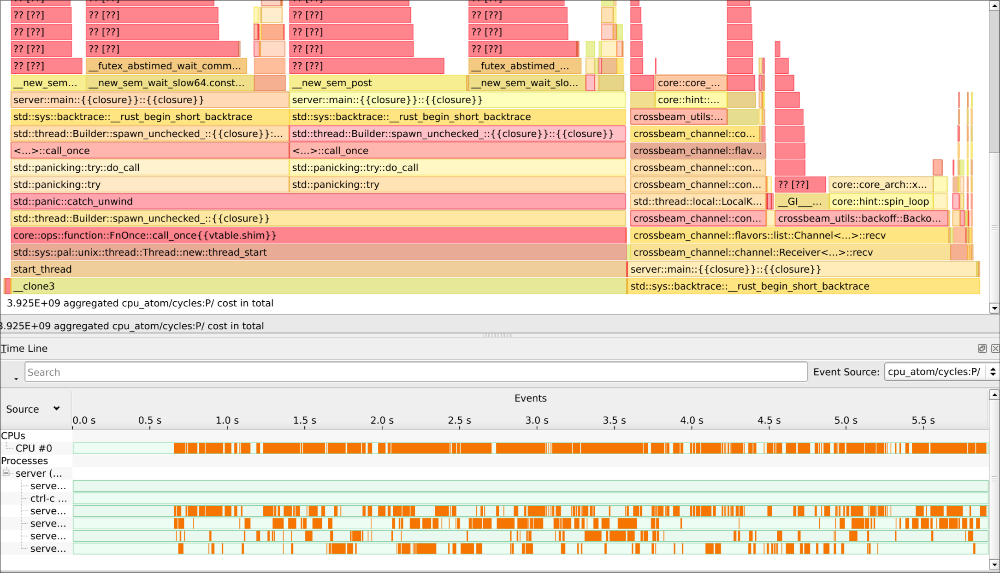
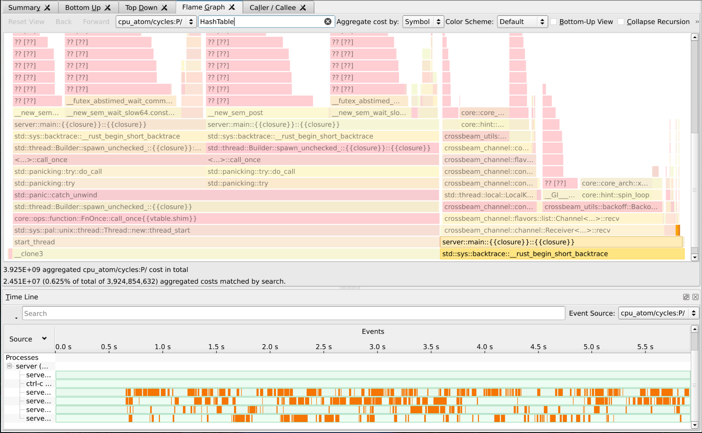
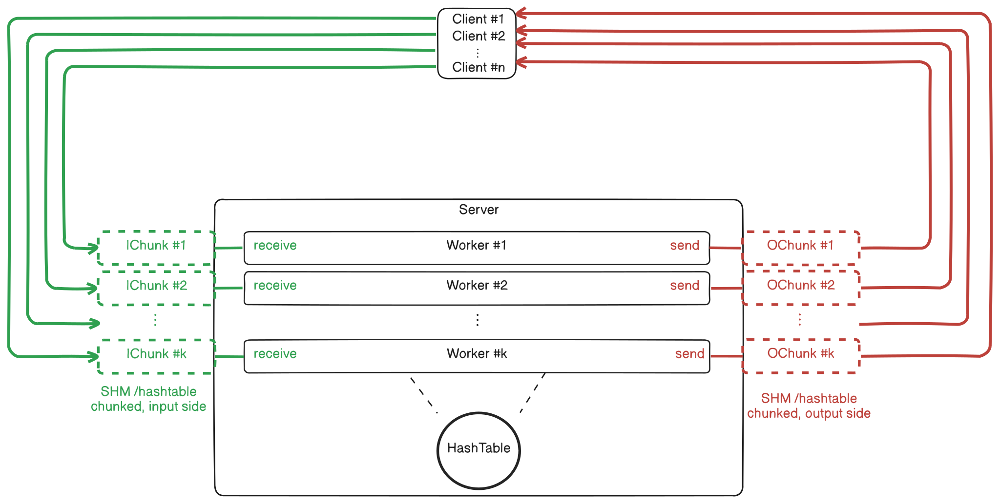

# Analysis of performance - Version before Ring Buffer Optimizations (branch `preopt`)

## Expectation
The expectation for a multi-threaded system like this would be that the
activity of multiple clients can be scheduled onto multiple server threads,
and therefore all clients experiencing only minor performance degradation (overhead),
as long as the number of clients does not exceed the number of worker threads

## Benchmarks
When running the benchmarks with `make bench`, one can see an output similar to the following:

```
--- Summary ---

alone at 16 threads is slower than alone at 1 thread: 0.89x
alone at 32 threads is slower than alone at 1 thread: 0.83x

alone at 1 thread is faster than one visitor at 1 thread: 1.64x
alone at 1 thread is faster than 16 visitors at 1 thread: 52.09x

alone at 16 threads is faster than one visitor at 16 threads: 1.62x
alone at 16 threads is faster than 16 visitors at 16 threads: 51.28x

16 visitors at 16 threads is slower than 16 visitors at 1 thread: 0.89x
```

This suggests that:
- The overhead for dispatching requests to the worker threads is significant (line 2)
- The payoff is nearly non-existant, as soon as multiple threads join the session, all clients experience
severe performance degradation (line 4) and multithreading does not help (line 6)

## Perf Evaluation
Looking at the server perf metrics obtained via `make perf` in HotSpot, the bottlenecks become clear:
(from `perf_server_4c_2thr_10000hms`)



More than 50% of CPU cycles are spent on communication with the clients over shared memory,
most of it on synchronization or waiting for progress (__new_sem_wait / __new_sem_post)

Of the remaining 50%, almost all of the cycles are spent on internal dispatching of requests
from the shared memory to the worker threads, and back.

As can be seen in this flamegraph, only ~0.7% of cycles are actually spent on processing requests
to the Hash Table (including waiting for locks on the buckets)



These results strongly suggest that the bottleneck causing the performance degradation is located
in the communication architecture of the system

## The Architecture Bottleneck
The system architecture can be described with the following chart:


The performance issues originate in the contention on the shared memory buffers,
which have to be synchronized between the server and all clients

The requests channel is structured in a simple fashion, with two locks passed between the server and one of the clients

Performance-wise, this leads to a bottleneck where only one client can write at a time, and everyone has to wait for the
server to finish reading, effectively serializing the communication


The response channel is synchronized with a two-phase barrier, which involves multiple mutexes and semaphores

In my first attempt to synchronization of the channel, it was possible for all threads to read at the same time
after the server finished writing a message.
Unfortunately, it was not possible for me to achieve correctness in a reasonable time frame, so the current approach allows all threads
to only read after each other

## Future Improvement Possibilities

To fix the issues imposed by the current architecture, the system could be restructured to look like this:




Here, each client would directly share memory with one worker, eliminating the bottleneck and removing
the overhead for internal message passing

All other mechanisms could be left the same, as synchronization is still required, when `n > k`
(more than one client per worker)

As an optimization, when only one client is connected to a workers' output memory, we could switch to a
spsc (waker / busy locks) channel, similar to the current input channel synchronization.

For reducing the number of shared-memory descriptors that are used, it is also possible to chunk
the memory region, instead of creating multiple regions.

At the start of the new shared memory area, there would need to be a metadata table informing the clients,
how many worker threads are active:

```
---start region---
u32 MAGIC
u32 num_workers
** (block1) **
[input-related objects]
[output-related objects]
** (block2) **
[input-related objects]
[output-related objects]
...
** (blockn) **
[input-related objects]
[output-related objects]
---end region---
```

Access to the `num_workers` variable does not require synchronization,
as it will never be written again after initialization
